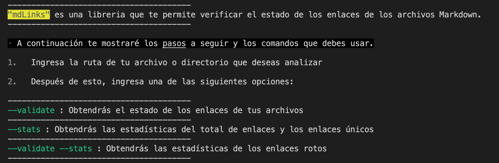
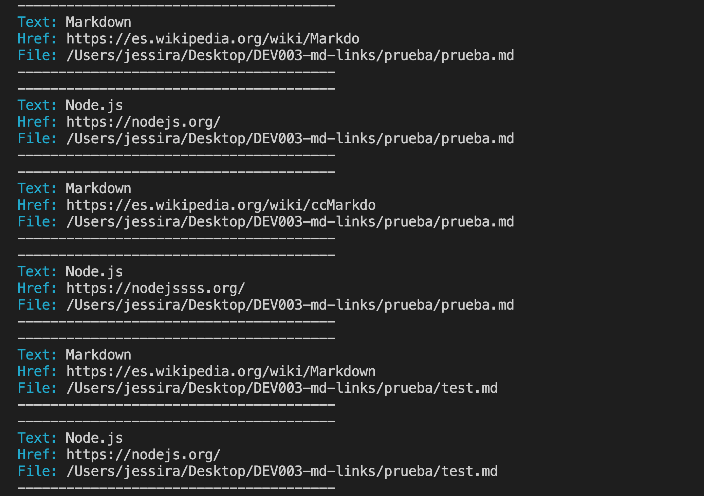
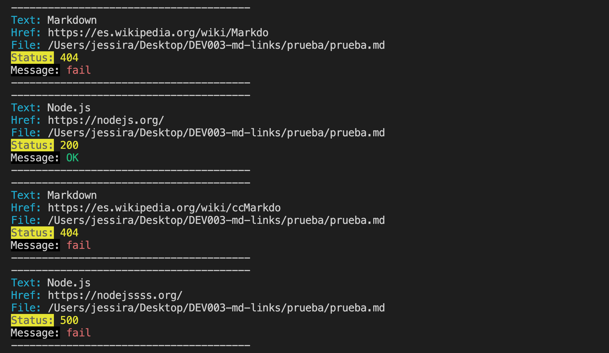
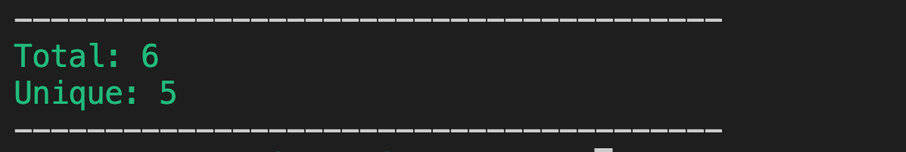
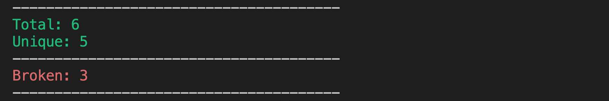

# Markdown Links

## Índice

* [1. Preámbulo](#1-preámbulo)
* [2. Resumen del proyecto](#2-resumen-del-proyecto)
* [3. Instalación](#3-instalación)
* [4. Comandos](#4-comandos)
* [5. Autora](#5-autora)

## 1. Preámbulo

[Markdown](https://es.wikipedia.org/wiki/Markdown) es un lenguaje de marcado
ligero muy popular entre developers. Es usado en muchísimas plataformas que
manejan texto plano (GitHub, foros, blogs, ...) y es muy común
encontrar varios archivos en ese formato en cualquier tipo de repositorio
(empezando por el tradicional `README.md`).

Estos archivos `Markdown` normalmente contienen links (vínculos/ligas) que
muchas veces están rotos o ya no son válidos y eso perjudica mucho el valor de
la información que se quiere compartir.

Dentro de una comunidad de código abierto, nos han propuesto crear una
herramienta usando [Node.js](https://nodejs.org/), que lea y analice archivos
en formato `Markdown`, para verificar los links que contengan y reportar
algunas estadísticas.

## 2. Resumen del proyecto

mdLinks es una libreria creada con NodeJS que permite verificar el estado de los enlaces que se encuentran en un archivo Markdown.

Esta biblioteca es útil para verificar si algunos de nuestros enlaces están repetidos, rotos o son inválidos.

## 3. Instalación

```sh
$ npm install md-links-linkMinder
```

## 4. Comandos 

Accede a la terminal y ejecuta el comando
```sh
$ md-links --help
 ```

 Esto te mostrará las instrucciones para seguir y podrás conocer todas las opciones y argumentos disponibles para utilizar la herramienta.

**Ejemplo**

```sh
$ md-links --help
```



El segundo paso es incertar la ruta a validar: ```md-links ./path-a-evaluar.md```

Sólo colocando la ruta obtendremos un arreglo de objetos con las propiedades:

```Href:``` URL encontrada.

```Text:``` Texto que aparecía dentro del link (<a>).

```File:``` Ruta del archivo donde se encontró el link.

**Ejemplo**




**Opciones**

  **Comando --Validate**
```sh
$ md-links <path> --validate
```
Obtendrás el estado de los enlaces de tus archivos

**Ejemplo**




  **Comando --stats**
```sh
$ md-links <path> --stats
```
Obtendrás las estadísticas del total de enlaces y los enlaces únicos

**Ejemplo**




  **Comando --validate --stats**
```sh
$ md-links <path> --validate --stats
```
Obtendrás las estadísticas de los enlaces rotos

**Ejemplo**



__Asegurese de ingresar una ruta valida que contenga archivos tipo Markadown__


